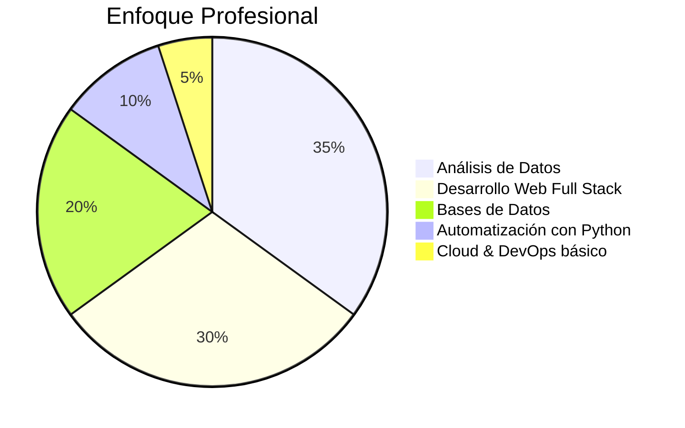

  
# 👋 ¡Hola! Soy Roger Cipagauta

---

## 🧠 Perfil Profesional

Ingeniero de Sistemas con enfoque en administración, modelado y análisis de bases de datos. Experiencia en el uso de SQL, Python y Power BI para automatización de procesos, visualización de información y generación de reportes analíticos.

He participado en proyectos de desarrollo full stack con Laravel y React, integrando frontend y backend con servicios de datos.

Mi principal fortaleza es convertir información técnica en soluciones funcionales que optimizan procesos y apoyan la toma de decisiones.

 

---

## 🗄️ Bases de Datos & Análisis

  
 
 
 

**Habilidades:**
- Modelado de bases de datos relacionales
- Consultas SQL avanzadas
- Normalización y diseño de esquemas
- Reportes analíticos con Power BI
- Automatización de análisis con Python (Pandas, Matplotlib)

---

## 🧑‍💻 Desarrollo Web Full Stack

  
 
 
 

**Stack:**
- **Frontend:** React, HTML, CSS, JavaScript, Tailwind, Bootstrap
- **Backend:** PHP (Laravel), Python (Flask, Django)
- Integración frontend/backend con APIs
- Autenticación, CRUDs, dashboards y paneles administrativos

---

## 📊 Análisis y Visualización

 
  
 
 
 

- Dashboards analíticos
- Limpieza y transformación de datos
- Visualización de indicadores (KPIs)
- Automatización de reportes

---

## ⚙️ Otras Herramientas

 
  
 
 
 

- Control de versiones
- Uso de terminal Linux
- Conceptos básicos de cloud
- Google Search Console

---

## 📈 En qué me especializo hoy

---

  

### 💬 ¡Conectemos!

