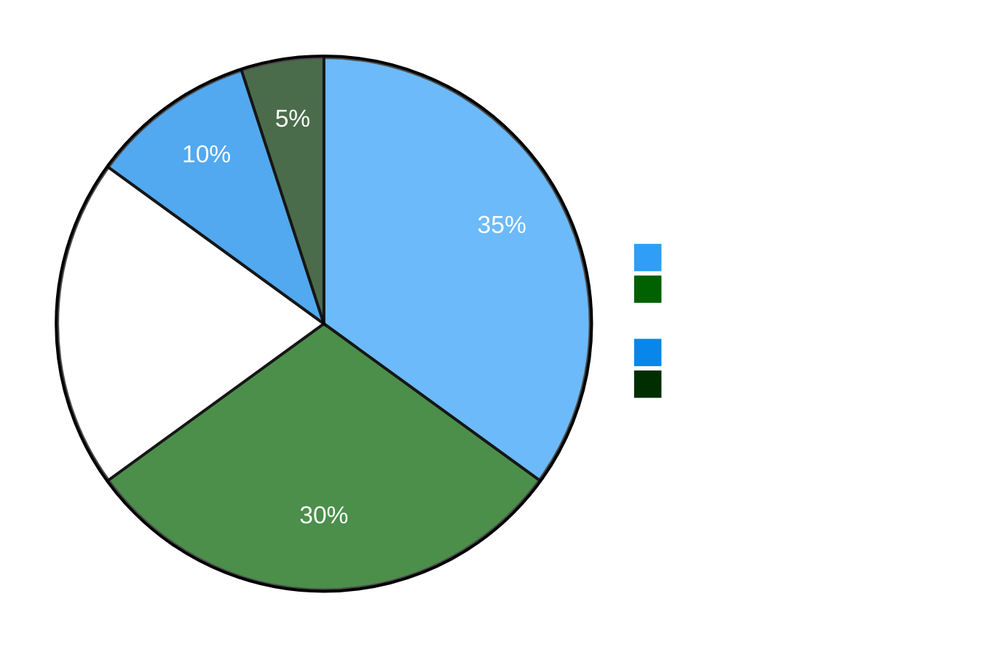
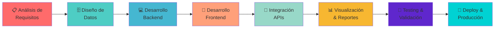

# 👋 **¡Hola! Soy Roger Cipagauta**

<div align="center">


</div>

---

## 🧠 **Perfil Profesional**


**Ingeniero de Sistemas** especializado en **administración, modelado y análisis de bases de datos**. Mi enfoque está en transformar datos en información accionable mediante el uso de tecnologías modernas.

### **🎯 Áreas de Especialización:**
- 📊 **Análisis de Datos:** SQL avanzado, Python (Pandas, NumPy, Matplotlib)
- 🗄️ **Gestión de Bases de Datos:** MySQL, SQL Server, SQLite, Supabase
- 📈 **Business Intelligence:** Power BI, visualización de KPIs
- 🌐 **Desarrollo Full Stack:** React + Laravel + APIs RESTful
- 🤖 **Automatización:** Scripts Python, ETL, reportes automatizados

### **💡 Propuesta de Valor:**
Convierto información técnica compleja en **soluciones funcionales** que optimizan procesos empresariales y apoyan la **toma de decisiones estratégicas** basadas en datos.

<br clear="right"/>


---

## 🗄️ **Bases de Datos & Análisis de Datos**

<div align="center">

### **Plataformas de Datos**

 
 
 


</div>

### **💼 Competencias Técnicas:**

| Área | Habilidades |
|------|-------------|
| **📐 Diseño de Datos** | • Modelado ER (Entidad-Relación)<br>• Normalización hasta 3FN<br>• Diseño de esquemas escalables<br>• Optimización de índices |
| **🔍 Consultas SQL** | • JOINs complejos<br>• Subconsultas y CTEs<br>• Window Functions<br>• Stored Procedures y Triggers |
| **📊 Análisis** | • Análisis exploratorio de datos (EDA)<br>• Segmentación y clustering<br>• Identificación de patrones y tendencias<br>• Limpieza y transformación (ETL) |
| **🤖 Automatización** | • Scripts Python (Pandas, SQLAlchemy)<br>• Pipelines de datos<br>• Reportes programados<br>• Integración con APIs |

---

## 🧑‍💻 **Desarrollo Web Full Stack**

<div align="center">

### **Stack Tecnológico**

#### **Frontend**
 
 
 


#### **Frameworks CSS**


#### **Backend**
 
 


</div>

### **🛠️ Capacidades de Desarrollo:**

```
Frontend                Backend              Integración
├── React Components    ├── Laravel MVC      ├── RESTful APIs
├── State Management    ├── Blade Templates  ├── Autenticación JWT
├── Responsive Design   ├── Eloquent ORM     ├── CORS Management
├── Hooks & Context     ├── Migrations       ├── Axios/Fetch
└── UI Libraries        └── Middleware       └── API Documentation
```

### **✨ Proyectos Destacados:**

| Proyecto | Stack | Funcionalidad |
|----------|-------|---------------|
| **Sistema de Ventas** | Laravel + MySQL | CRUD completo, validaciones, reportes |
| **Dashboard Analítico** | React + Chart.js | Visualización en tiempo real |
| **Landing Pages** | HTML/CSS/JS | Formularios, galerías multimedia |
| **APIs RESTful** | Flask/Django + PostgreSQL | Endpoints seguros, documentación Swagger |

---

## 📊 **Business Intelligence & Visualización**

<div align="center">

 
 
 


</div>

### **📈 Herramientas de Análisis:**

| Categoría | Herramientas & Técnicas |
|-----------|-------------------------|
| **Visualización** | • Dashboards interactivos en Power BI<br>• Gráficos estadísticos (Python)<br>• Reportes ejecutivos en Excel<br>• Storytelling con datos |
| **Transformación** | • Power Query (M language)<br>• DAX para medidas calculadas<br>• Pandas para ETL<br>• SQL para agregaciones |
| **KPIs** | • Métricas de negocio<br>• Indicadores de rendimiento<br>• Análisis de tendencias<br>• Benchmarking |
| **Automatización** | • Actualización automática de reportes<br>• Alertas programadas<br>• Integración con bases de datos<br>• Exportación programada |

---

## ⚙️ **Herramientas & Tecnologías Complementarias**

<div align="center">

### **Control de Versiones & DevOps**
 
 


### **Sistemas Operativos & Cloud**
 


### **Otras Herramientas**


</div>

### **🔧 Competencias Adicionales:**

- ✅ **Git Flow:** Branching strategies, pull requests, resolución de conflictos
- ✅ **Terminal Linux:** Bash scripting, administración de servidores
- ✅ **Cloud Computing:** EC2, S3, RDS (nivel básico-intermedio)
- ✅ **SEO Técnico:** Google Search Console, meta tags, sitemap
- ✅ **Contenedorización:** Docker básico para ambientes de desarrollo

---

## 📈 **Distribución de Especialización**

<div align="center">



</div>

---

## 🎯 **Metodología de Trabajo**

<div align="center">



</div>

---

## 💼 **Casos de Uso & Soluciones**

### **🔹 Análisis de Datos Empresariales**
```python
# Ejemplo: Análisis de ventas con Pandas
import pandas as pd
import matplotlib.pyplot as plt

# Cargar y analizar datos
df = pd.read_sql("SELECT * FROM ventas", conexion)
ventas_mensuales = df.groupby('mes')['monto_total'].sum()

# Visualizar tendencia
ventas_mensuales.plot(kind='line', title='Tendencia de Ventas')
plt.show()
```

### **🔹 Dashboard Interactivo**
```javascript
// Ejemplo: Componente React con datos en tiempo real
import { useState, useEffect } from 'react';
import { LineChart } from 'recharts';

function SalesDashboard() {
  const [data, setData] = useState([]);
  
  useEffect(() => {
    fetch('/api/sales')
      .then(res => res.json())
      .then(setData);
  }, []);
  
  return <LineChart data={data} />;
}
```

### **🔹 API RESTful con Laravel**
```php
// Endpoint para consulta de ventas
Route::get('/ventas', function() {
    return Venta::with('cliente')
        ->whereBetween('fecha_venta', [request('inicio'), request('fin')])
        ->get();
});
```

---

## 📚 **Aprendizaje Continuo**

### **🎓 Actualmente Explorando:**

<div align="center">

| Tecnología | Propósito | Progreso |
|------------|-----------|----------|
| 🤖 **Machine Learning** | Scikit-learn, predicciones | 🟢🟢🟢⚪⚪ 60% |
| 📊 **Tableau** | Visualización avanzada | 🟢🟢⚪⚪⚪ 40% |
| ☁️ **AWS Certified** | Arquitectura cloud | 🟢🟢🟢⚪⚪ 55% |
| 🐳 **Docker/K8s** | Orquestación contenedores | 🟢🟢⚪⚪⚪ 45% |

</div>

---

## 🌟 **Ventajas Competitivas**

<table>
<tr>
<td width="50%">

### **🎯 Enfoque Técnico**
- ✅ Dominio completo del stack de datos
- ✅ Integración frontend + backend + DB
- ✅ Automatización de procesos repetitivos
- ✅ Documentación clara y mantenible

</td>
<td width="50%">

### **💡 Enfoque de Negocio**
- ✅ Traducción técnica → lenguaje ejecutivo
- ✅ Soluciones orientadas a resultados
- ✅ Optimización de costos operativos
- ✅ Soporte a decisiones data-driven

</td>
</tr>
</table>

---

## 📫 **Contacto & Colaboración**

<div align="center">


### **💬 ¡Conectemos!**

[](https://linkedin.com/in/tu-perfil)
[](https://github.com/RogerCipa7)
[](mailto:tu-email@ejemplo.com)
[](https://tu-portfolio.com)

---

### **🚀 Abierto a:**
- 💼 Oportunidades laborales en análisis de datos y desarrollo full stack
- 🤝 Colaboraciones en proyectos open source

---


**"Transformando datos en decisiones, código en soluciones"**

⭐ **Si te gusta mi trabajo, sígueme en GitHub!** ⭐

</div>
