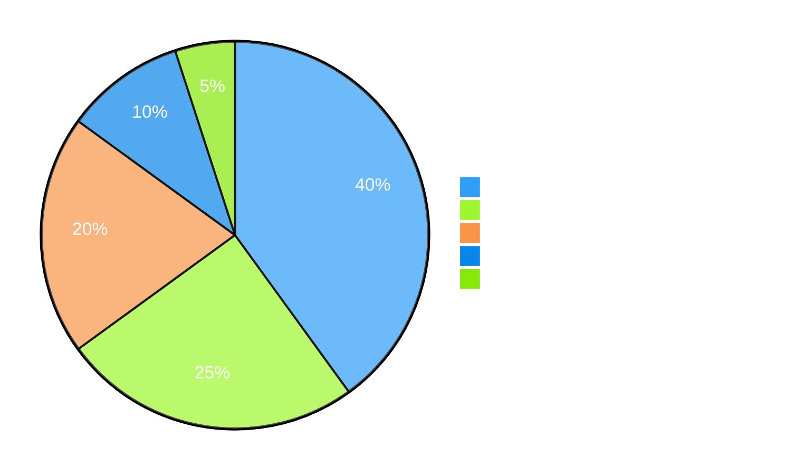
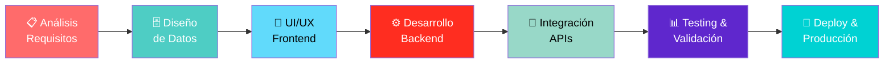

# 👋 ¡Hola! Soy **Roger Cipagauta**

---

## 🧠 Perfil Profesional

**Ingeniero de Sistemas** con enfoque en **Desarrollo Frontend** y en ruta al **Full Stack**. Apasionado por construir interfaces modernas, escalables y de alto impacto visual, con una sólida base en arquitectura de software y bases de datos.

### 🎯 Especialización actual:
- 🎨 **Frontend:** React, Next.js, Angular, TypeScript, Tailwind CSS
- 🔧 **Backend:** Laravel, PHP, Python/Django, Flask, C#/.NET
- 🗄️ **Bases de Datos:** MySQL, PostgreSQL, SQL Server, Supabase
- 📊 **Data & BI:** Pandas, Power BI, ETL, análisis exploratorio
- 🤖 **Automatización:** Scripts Python, pipelines de datos, APIs RESTful

### 💡 Propuesta de Valor:
Creo ecosistemas digitales **funcionales, escalables y bien documentados**, aplicando principios **SOLID** y **Clean Architecture** para resolver problemas reales de negocio.

 

| 🏆 15+ Proyectos | ⚙️ 20+ Tecnologías | 💾 800+ Commits |
|:-:|:-:|:-:|

---

## 🎨 Frontend — Mi Área Principal

### Frameworks & Librerías UI

### Estilos & Diseño

### 📐 Competencias Frontend:

| Área | Dominio |
|------|---------|
| **React / Next.js** | Hooks, Context API, SSR, SSG, App Router — `95%` |
| **Angular** | Componentes, servicios, RxJS, routing — `85%` |
| **TypeScript** | Tipado estricto, interfaces, genéricos — `85%` |
| **JavaScript ES6+** | Async/Await, desestructuración, módulos — `92%` |
| **Tailwind CSS** | Utility-first, diseño responsivo, dark mode — `95%` |
| **Responsive Design** | Mobile-first, Grid, Flexbox — `98%` |
| **Astro** | Islands architecture, SSG, TypeScript — `80%` |

---

## ⚙️ Backend — En construcción al Full Stack

| Tecnología | Nivel |
|------------|-------|
| **PHP / Laravel** | MVC, Eloquent ORM, Blade, Migrations — `90%` |
| **Python / Django** | ORM, vistas, autenticación — `82%` |
| **Flask** | APIs ligeras, ETL, integración de datos — `78%` |
| **C# / .NET** | Fundamentos, APIs básicas — `75%` |
| **RESTful APIs** | Diseño, documentación Swagger, JWT — `95%` |
| **System Architecture** | SOLID, Clean Architecture, patrones — `85%` |

---

## 🗄️ Bases de Datos

| Competencia | Nivel |
|-------------|-------|
| **MySQL / PostgreSQL** | Diseño, JOINs, índices, optimización — `92%` |
| **SQL Server** | Stored Procedures, triggers, vistas — `88%` |
| **DB Design & Normalización** | Modelado ER, 3FN, esquemas escalables — `95%` |
| **Query Optimization** | CTEs, Window Functions, planes de ejecución — `90%` |
| **Supabase** | Auth, Realtime, Row Level Security — `82%` |
| **NoSQL Basics** | Conceptos, MongoDB básico — `70%` |

---

## 📊 Data & Business Intelligence

---

## ⚙️ DevOps, Cloud & Herramientas

### Control de Versiones

### Cloud & Hosting

### OS & Terminal

### Herramientas de Desarrollo

| Competencia | Nivel |
|-------------|-------|
| **Git / GitHub** | Git Flow, PRs, resolución de conflictos — `95%` |
| **Linux / Bash** | Scripting, administración de servidores — `88%` |
| **Clean Architecture** | SOLID, patrones de diseño, modularidad — `90%` |
| **AWS** | EC2, S3, RDS (básico-intermedio) — `55%` |

---

## 🚀 Proyectos Destacados

```mermaid
graph TD
    A[🎨 Portafolio Personal<br/>React + Vite + Tailwind] 
    B[💅 GlowBook — Centro de Estética<br/>React + TypeScript + Supabase]
    C[🏭 PURASER — Limpieza Láser<br/>Laravel + PHP + Google Calendar]
    D[📊 Dashboard Ventas Automotrices<br/>Python + Flask + Pandas]
    E[🏎️ Revista Automotriz<br/>Astro + TypeScript + Tailwind]
    F[🥊 UFC Fan — Mundo MMA<br/>Next.js 14 + TypeScript]
    G[💀 Iron Core Gym<br/>Next.js 16 + TypeScript]
    H[🎵 Spotify Clone RC<br/>React 18 + iTunes API]

    style A fill:#61DAFB,color:#000
    style B fill:#FF69B4,color:#000
    style C fill:#FF2D20,color:#fff
    style D fill:#3776AB,color:#fff
    style E fill:#FF5D01,color:#fff
    style F fill:#D4AF37,color:#000
    style G fill:#1a1a1a,color:#fff
    style H fill:#1DB954,color:#000
```

| Proyecto | Stack | Tipo | Highlights |
|----------|-------|------|------------|
| 🎨 **Portafolio Personal** | React · Vite · Tailwind | Frontend | Sitio personal, buenas prácticas, diseño moderno |
| 💅 **GlowBook** | React · TS · Supabase | Full Stack | Reservas en tiempo real, dashboard analítico, auth |
| 🏭 **PURASER** | Laravel · PHP · Tailwind | Full Stack | Sitio corporativo + agendamiento Google Calendar |
| 📊 **Dashboard Automotriz** | Python · Flask · Pandas | Backend/Data | ETL automático, visualización de métricas |
| 🏎️ **Revista Automotriz** | Astro · TS · Tailwind | Frontend | Catálogo interactivo, dark/light, animaciones |
| 🥊 **UFC Fan** | Next.js 14 · TS | Frontend | Luchadores, eventos, animaciones, 100% responsive |
| 💀 **Iron Core Gym** | Next.js 16 · TS | Frontend | Diseño brutalista, 8 secciones, component-driven |
| 🎵 **Spotify Clone RC** | React 18 · iTunes API | Frontend | Reproductor real, favoritos, shuffle/repeat, SPA |

---

## 📈 Enfoque Actual

```mermaid
%%{init: {'theme':'base', 'themeVariables': {'primaryColor':'#2E9EF7','primaryTextColor':'#fff','primaryBorderColor':'#1a75d2','lineColor':'#F8B229'}}}%%
pie title "Distribución de Especialización"
    "Frontend (React/Next/Angular)" : 40
    "Full Stack & Backend" : 25
    "Bases de Datos" : 20
    "Data & Automatización" : 10
    "DevOps & Cloud" : 5
```

---

## 🎓 Certificaciones

| Año | Certificación | Emisor |
|-----|--------------|--------|
| 2025 | 📊 Introducción al Análisis de Datos con Python | Desafío Latam |
| 2025 | 🔐 Ethical Hacker | Cisco Academy |
| 2025 | 🛡️ Diplomado en Ciberseguridad | Universitaria de Colombia |
| 2024 | 🖥️ Operating Systems Basics | Cisco Academy |
| 2024 | 🌐 Network Addressing & Basic Troubleshooting | Cisco Academy |
| 2024 | 📋 Scrum Foundation Professional (SFPC™) | Certiprof |
| 2024 | 🤖 Introduction to IoT | Cisco Academy |

---

## 🧭 Metodología de Trabajo

```mermaid
graph LR
    A[📋 Análisis<br/>Requisitos] --> B[🗄️ Diseño<br/>de Datos]
    B --> C[🎨 UI/UX<br/>Frontend]
    C --> D[⚙️ Desarrollo<br/>Backend]
    D --> E[🔗 Integración<br/>APIs]
    E --> F[📊 Testing &<br/>Validación]
    F --> G[🚀 Deploy &<br/>Producción]

    style A fill:#FF6B6B,color:#fff
    style B fill:#4ECDC4,color:#fff
    style C fill:#61DAFB,color:#000
    style D fill:#FF2D20,color:#fff
    style E fill:#98D8C8,color:#000
    style F fill:#5F27CD,color:#fff
    style G fill:#00D2D3,color:#fff
```

---

## 🌟 Ventajas Competitivas

<table>
<tr>
<td width="50%">

### 🎯 Técnico
- ✅ Frontend moderno: React, Next.js, Angular
- ✅ TypeScript desde el día uno
- ✅ Clean Architecture & SOLID
- ✅ Diseño responsive y accesible
- ✅ Integración completa frontend + backend + DB
- ✅ APIs RESTful documentadas

</td>
<td width="50%">

### 💡 Soft Skills & Negocio
- ✅ Código legible y mantenible
- ✅ Soluciones orientadas a resultados
- ✅ Aprendizaje continuo y autodidacta
- ✅ Trabajo en equipo con Git Flow
- ✅ Documentación clara
- ✅ Abierto a feedback y mejora constante

</td>
</tr>
</table>

---

## 📚 Aprendiendo Ahora

| Tecnología | Propósito | Progreso |
|------------|-----------|----------|
| 🤖 **Machine Learning** | Scikit-learn, predicciones | 🟢🟢🟢⚪⚪ 60% |
| ☁️ **AWS Certified** | Arquitectura cloud | 🟢🟢🟢⚪⚪ 55% |
| 📊 **Tableau** | Visualización avanzada | 🟢🟢⚪⚪⚪ 40% |

---

## 📫 Contacto & Colaboración

### 💬 ¡Conectemos!

---

### 🚀 Abierto a:
- 💼 Roles Frontend / Full Stack Junior-Mid
- 🤝 Colaboraciones en proyectos open source
- 📁 Freelance y proyectos con impacto real

---

**"Transformando ideas en productos digitales — código limpio, interfaces que enamoran"**

⭐ **¡Si te gusta mi trabajo, sígueme en GitHub!** ⭐

